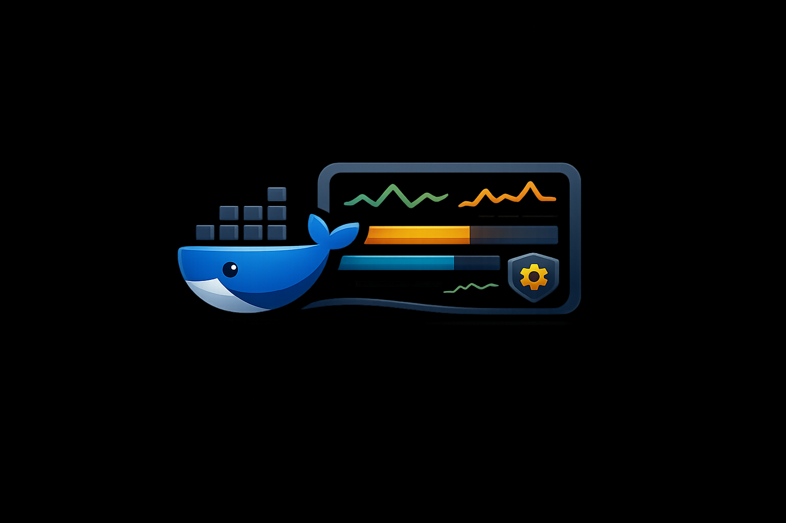

# MiniPort

<p align="center">
  
</p>

[](https://go.dev)
[](https://docs.docker.com/engine/api/sdk/)
[](LICENSE)

A lightweight Docker and systemd dashboard. Single Go binary, no database, no container required. Built for resource-constrained servers.

## Features

### Containers
- **Dashboard** — 7-column CSS grid table with search, state filters (All/Running/Stopped), and sortable columns
- **Inline stats** — CPU and memory bars with raw MB values, updated via background collector
- **Sparkline charts** — SVG CPU and memory trend lines from ring buffer history, stacked with port badges
- **Actions** — icon buttons (Stop/Start, Restart, Logs) with overflow menu (Stats, Inspect, Remove) via CSS-only `<details>` dropdown
- **Stopped containers** — visually muted rows with reduced opacity
- **Logs** — configurable tail lines (50/100/500/1000), in-log search with highlighting, live streaming via 2s polling, pause/resume on scroll, copy-to-clipboard, server-side syntax coloring (timestamps, key=value pairs, error highlighting)
- **Stats panel** — live CPU, memory, network, and disk I/O with history sparklines
- **Inspect panel** — container config, environment (masked by default), ports, networks, mounts, and labels in CSS-only tabbed interface
- **Prune** — clean up containers, images, volumes, and networks via nav dropdown

### Host
- **System metrics** — 5 metric cards (CPU, memory, disk, network, uptime) with thin progress bars (Linux only, via `/proc`)

### Systemd Services
- **Service monitoring** — CSS grid table alongside Docker containers with matching visual style
- **Live status** — active/inactive/failed state with CPU% and memory usage
- **Actions** — icon buttons (Stop/Start, Restart) with Logs
- **Logs** — journal output with syntax coloring, search, streaming, and all container log controls
- **Zero dependencies** — uses `systemctl` and `journalctl` via `os/exec`, no D-Bus library

### General
- **Dark theme** — CSS custom properties with semantic color tokens, monospace-forward typography
- **Toast notifications** — success/error feedback on all actions
- **Responsive layout** — stacked card layout below 900px, hidden sparklines on mobile
- **Health endpoint** — `GET /healthz` for uptime monitors
- **Auto-refresh** — container and service tables poll every 10s, stats every 5s

## Stack

| Layer | Choice |
|-------|--------|
| Backend | Go stdlib `net/http` (zero framework dependencies) |
| Docker | [Official SDK](https://pkg.go.dev/github.com/docker/docker/client) |
| Systemd | `systemctl` / `journalctl` via `os/exec` (Linux only) |
| Frontend | HTMX (only external JS dependency) |
| Templates | Go `html/template` via `go:embed` |
| CSS | Embedded stylesheet with CSS custom properties, no CDN, no framework |

No JavaScript build step. No database. No framework. All state comes from the Docker daemon and systemd.

## Requirements

- Go 1.22+
- Docker daemon running (accessible via `/var/run/docker.sock`)
- Linux for host metrics and systemd service monitoring (graceful no-op on other platforms)

## Quick Start

```bash
git clone https://github.com/emm5317/miniport.git
cd miniport
go build -ldflags="-s -w" -o miniport ./cmd/miniport
./miniport
```

Listens on `127.0.0.1:8092` by default. Configure via environment variables:

| Variable | Default | Description |
|----------|---------|-------------|
| `MINIPORT_HOST` | `127.0.0.1` | Bind address |
| `MINIPORT_PORT` | `8092` | Bind port |
| `MINIPORT_LOG_TAIL_LINES` | `100` | Default log lines per container/service |
| `MINIPORT_LOG_REQUESTS` | `false` | Enable HTTP request logging |
| `MINIPORT_STATS_INTERVAL` | `15` | Background stats collection interval (seconds) |
| `MINIPORT_SERVICES` | *(empty)* | Comma-separated systemd service names to monitor |
| `MINIPORT_AUTH` | *(empty)* | Path to auth file for HTTP Basic Authentication (see [Security](#security)) |

## Deploy with systemd

```ini
[Unit]
Description=MiniPort Docker Dashboard
After=network.target docker.service

[Service]
Type=simple
ExecStart=/opt/miniport/miniport
EnvironmentFile=/opt/miniport/.env
Restart=always
RestartSec=5

[Install]
WantedBy=multi-user.target
```

Example `/opt/miniport/.env`:
```
MINIPORT_SERVICES=voicetask,caddy,postgresql
```

Put behind a reverse proxy (Caddy, nginx) with TLS — the Docker socket is root-equivalent access.

## Security

MiniPort includes optional HTTP Basic Authentication. To enable it:

1. Create an auth file with `username:sha256hex` entries:
   ```bash
   # Generate a password hash
   echo -n 'your-password' | sha256sum | cut -d' ' -f1

   # Create the auth file
   echo "admin:$(echo -n 'your-password' | sha256sum | cut -d' ' -f1)" > /opt/miniport/auth
   ```

2. Set the `MINIPORT_AUTH` environment variable:
   ```bash
   MINIPORT_AUTH=/opt/miniport/auth ./miniport
   ```

The `/healthz` endpoint is always unauthenticated for monitoring probes.

Additional security features:
- **CSRF protection** — Origin/Referer validation on all state-changing requests
- **Security headers** — `X-Content-Type-Options`, `X-Frame-Options`, `Content-Security-Policy`, `Referrer-Policy`
- **Server timeouts** — Read, write, and idle timeouts to prevent slowloris attacks
- **Localhost by default** — Binds to `127.0.0.1`, not `0.0.0.0`

See [SECURITY.md](SECURITY.md) for the full security policy.

## Resource Usage

- **Binary size:** ~11 MB (stripped)
- **Idle RAM:** <20 MB
- **Direct dependencies:** 1 (Docker SDK)
- **No streaming connections** — stats are polled snapshots, not persistent goroutines

## License

MIT
